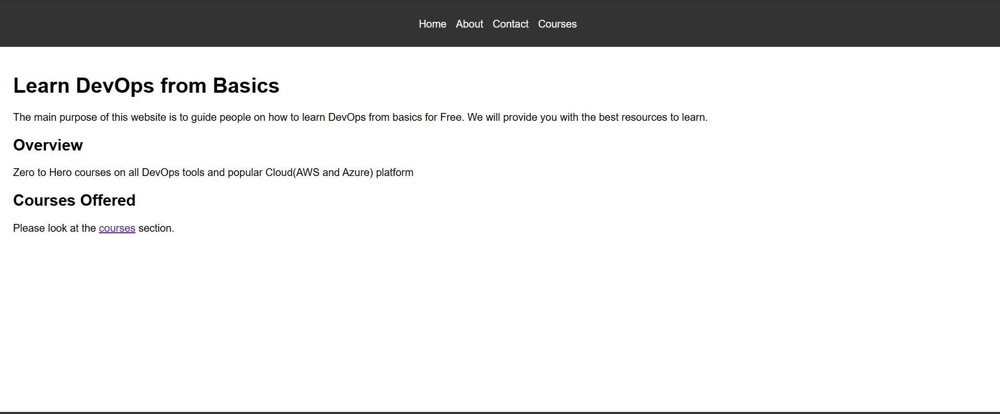
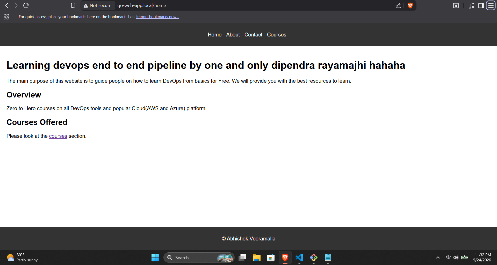
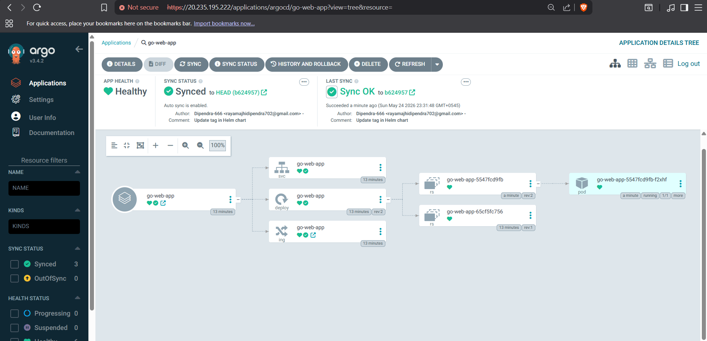
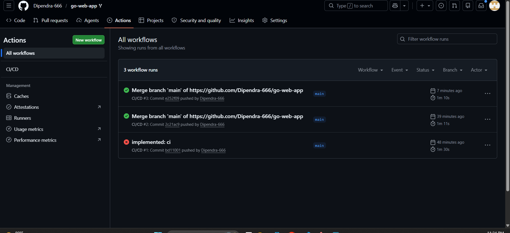
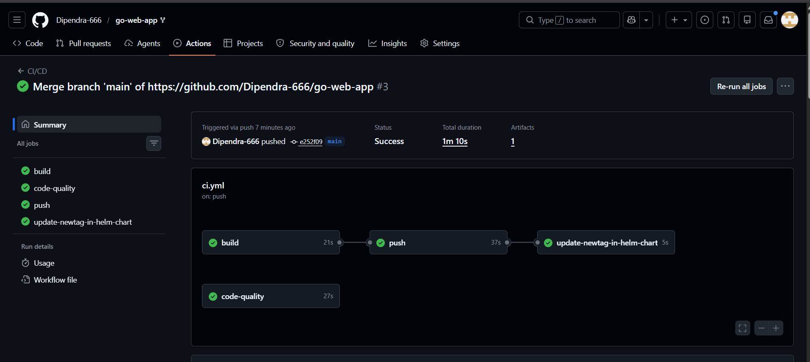
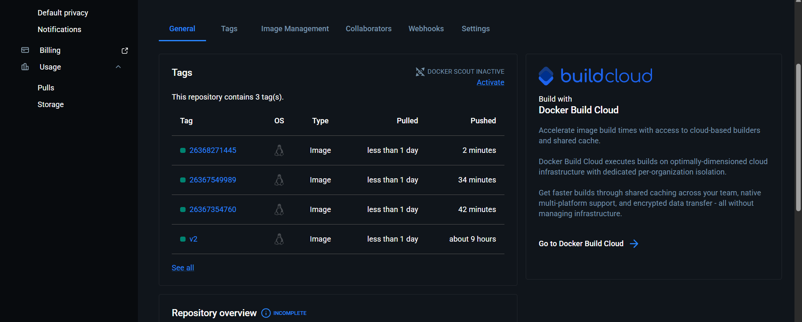

# End-to-End Kubernetes CI/CD Pipeline with GitOps

A complete production-ready CI/CD pipeline for a Go web application using **GitHub Actions**, **Docker**, **Kubernetes (AKS)**, **Helm**, and **Argo CD** (GitOps).

---

## Overview

This project showcases a modern **End-to-End DevOps workflow** that automatically builds, containers, and deploys a Go web application to **Azure Kubernetes Service (AKS)** using GitOps principles.

---

## Features

- Fully automated CI/CD using GitHub Actions
- Multi-stage Docker builds with distroless image
- GitOps deployment with Argo CD
- Automatic Helm chart updates on code change
- Zero-downtime deployment demonstration

---

## Screenshots

### 1. Application Running Successfully

*Live application after full setup on AKS*

---

### 2. Automated Deployment Triggered by Code Change

*Changed H1 heading in source code → Pipeline triggered automatically → Changes reflected in production without manual intervention*

---

### 3. ArgoCD Healthy Pods

*ArgoCD running healthy in the cluster*

---

### 4. GitHub Actions Pipeline - Successful Run

*Complete GitHub Actions pipeline executed successfully*

---

### 5. Pipeline Stages Details

*Detailed view of all successful pipeline stages*

---

### 6. Docker Hub Repository

*Docker images successfully built and pushed to Docker Hub*

---

## Tech Stack

- **Language**: Go
- **CI/CD**: GitHub Actions
- **Containerization**: Docker (Multi-stage + Distroless)
- **Orchestration**: Kubernetes (AKS)
- **Package Manager**: Helm
- **GitOps Tool**: Argo CD
- **Cloud**: Microsoft Azure
- **Ingress**: NGINX Ingress Controller

---

## Pipeline Workflow

1. Developer pushes code to `main` branch
2. GitHub Actions builds & tests the application
3. Docker image is built and pushed to Docker Hub
4. Helm values.yaml is automatically updated with new image tag
5. Argo CD detects the change and syncs the application to AKS
6. New version is live with zero manual deployment

---

## Key Highlights

- Production-optimized Docker images
- Proper Git branching strategy
- Self-healing GitOps deployment
- Clear demonstration of automation power

